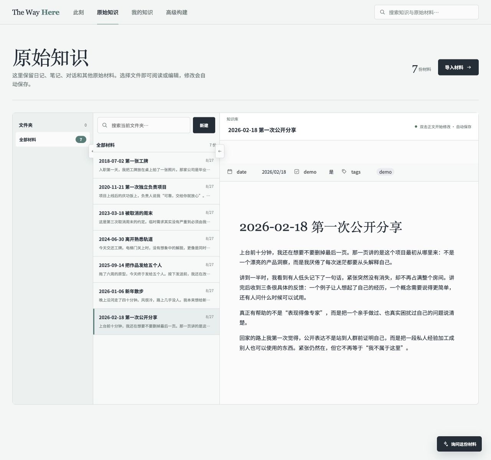
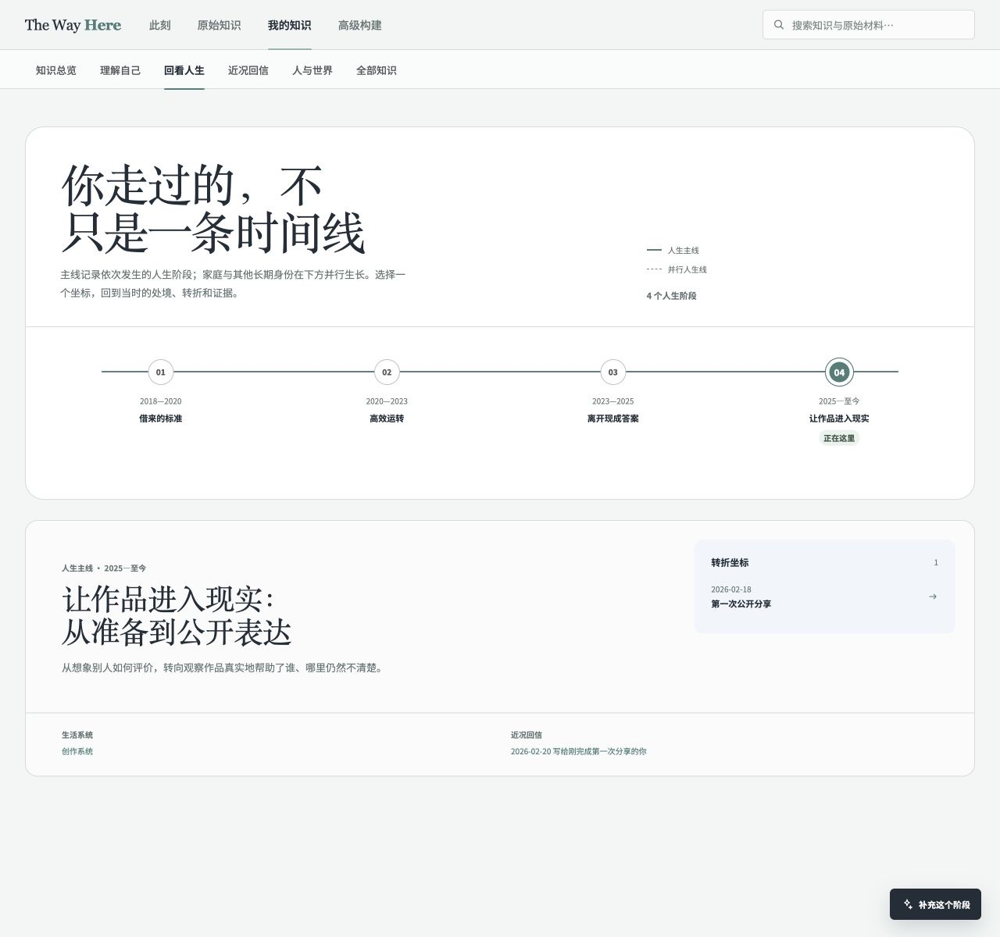
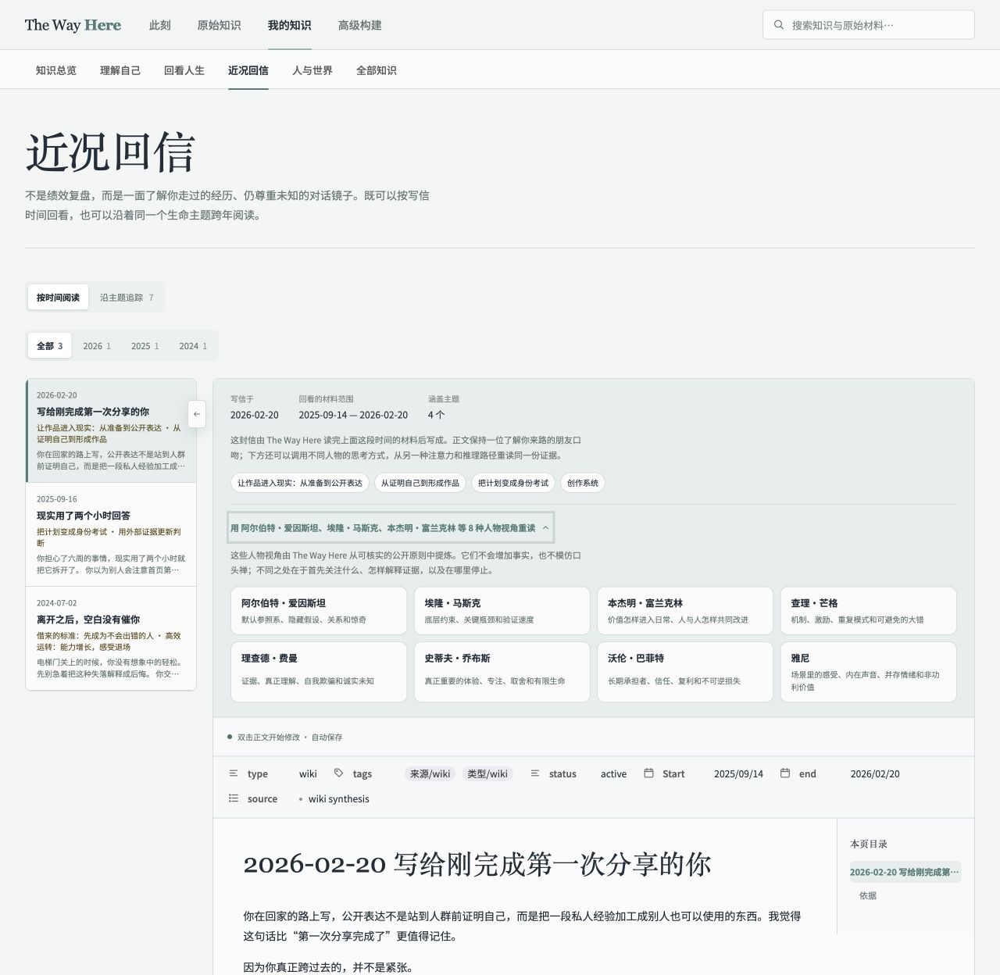

# the-way-here

> 让走过的路，成为更了解自己的方式。

## 项目定位

我们走过的生活，常常散落在不同的地方：写下的日记、与重要之人的对话、和 AI 的长谈、某一刻拍下的照片，以及那些当时没有意识到会如此重要的只言片语。你知道这些事情真实发生过，却很难在真正需要时重新找到它们，更难看见它们如何彼此连接，又如何一步步塑造了今天的你。

The Way Here 正是为此而生。它把散落在各处的人生材料，组织成一张可以阅读、检索，也可以持续修正的人生地图。你可以重新看见自己从哪里来、此刻站在哪里，让过去不再只是模糊的记忆，而成为理解当下的线索。

你还可以借用自己所欣赏的人物的思考视角，重新阅读走过的路：你曾经如何做出选择，在哪些地方反复受困，什么东西始终对你重要。不同视角不会替你定义人生，而是帮助你从习以为常的叙述之外，再多看见一种可能。

### 原文被好好留下，理解才有来处

下面的匿名样例，从一个人在八年间写下的七篇日记开始。左侧是按时间留下的原始记录，右侧仍然是当时写下的完整文字，没有被几个标签或一句摘要取代。

后来形成的“从证明自己到形成作品”、人生阶段与近况回信，也不是漂浮在原文之上的结论。它们都能沿着链接回到这些具体句子，等待你亲自核对、质疑，也等待新的经历到来之后，被重新理解。



### 当片段彼此照见，一条路才慢慢出现

一篇日记留下一个夜晚，几年的日记却可能共同回答：我为什么会走到这里？当记录被放回时间与处境，原本孤立的选择、迟疑和转折，才开始彼此照见。

图中的八年经历被整理为四个人生阶段。此刻不再是时间线末端的一个日期，而是一个有来路的坐标——它连接着曾经发生的转折、仍在运转的生活系统，以及写给现在这段生活的回信。



### 写给此刻的你，但不替未来下结论

有些时候，我们并不缺少建议，只是缺少一个真正知道前因后果的人。The Way Here 会把最近发生的事和真正相关的旧经历放在一起，以一位了解你来路的朋友口吻写下回信：看见已经发生的变化，也诚实保留仍然未知的部分。

同时，你还可以借用爱因斯坦、费曼、芒格、乔布斯等八种人物的思考方式，重新阅读同一组经历。这里借用的是他们关注问题的角度，而不是模仿口吻，更不会凭空增加属于你的事实。

我们想展示的是，当今天的一句话被放回走过的路上，它可以得到怎样更深、更诚实的回应。



## 你的经历，默认只留在你的电脑里

人生材料足够珍贵，也足够私密。The Way Here 采用本地优先的方式运行：你的日记、对话与构建出的 Wiki 默认都保存在本机，服务也只监听 `127.0.0.1`。公开仓库中只有匿名演示库，不包含真实的私人内容。

为了让这条边界清楚、可检查，项目把三部分彼此隔离：

- `studio/` 提供本地 Web 产品、API 服务、索引和 Agent 工作台。
- `knowledge-engine/` 提供可复用的知识构建 Skills、路由和确定性质量工具。
- `vault/` 只保存原始材料与构建后的 Wiki；公开仓库仅包含匿名演示库。

目前它被设计为属于一个人的本地工具，不包含账号体系、多用户权限或公网部署能力。如果要把它放到远程环境，请先补充认证、TLS、CSRF 防护和更严格的运行沙箱。

## 快速启动

仓库已经准备好一套匿名 `demo`。你不需要先放入自己的日记，就可以完整看看 The Way Here 如何整理材料、连接人生阶段，并写出一封有来路的回信。

环境要求：

- macOS 或 Linux
- Python 3
- Node.js 22.19+ 与 pnpm 11.19.0；一键启动脚本会在需要时为项目准备本地版本
- 使用 AI 工作台时，需要可用的 Codex CLI，或在配置中提供 Pi 模型服务

克隆或下载仓库后，在项目根目录运行：

```bash
./start.sh
```

脚本会自动检查环境、安装依赖并构建前后端。启动完成后，打开 <http://127.0.0.1:4321> 即可进入匿名样例；按 `Ctrl+C` 可以同时停止所有服务。

指定端口：

```bash
./start.sh --port 8080
```

当你准备开始整理自己的经历时，在 `the-way-here.config.yaml` 中登记本地知识库目录，再指定知识库 ID：

```yaml
knowledgeBases:
  personal:
    name: "My private Wiki"
    paths:
      wiki: "vault/personal/wiki"
      sources: "vault/personal/sources"
```

```bash
./start.sh --knowledge-base personal
```

`vault/personal/` 已被 Git 忽略。请不要把真实日记、人物资料、聊天记录、任务快照、Agent 会话、本机路径或密钥提交到公开仓库。

也可以打开另一套完整工作区：

```bash
./start.sh --vault /absolute/path/to/your-workspace --knowledge-base personal
```

该工作区需要包含自己的 `the-way-here.config.yaml`，并且配置中的路径必须位于工作区边界内。

## 开发与验证

如果你想参与开发，可以从 `studio/` 启动前后端开发环境：

```bash
cd studio
pnpm install
pnpm dev -- --vault .. --knowledge-base demo
```

提交改动前运行：

```bash
pnpm typecheck
pnpm test
pnpm build
```

修改 Wiki、Skills 或维护工具时，还应在项目根目录运行对应质量门：

```bash
THE_WAY_HERE_KNOWLEDGE_BASE=demo python3 knowledge-engine/tools/update_obsidian_tags.py
THE_WAY_HERE_KNOWLEDGE_BASE=demo python3 knowledge-engine/tools/update_obsidian_tags.py
THE_WAY_HERE_KNOWLEDGE_BASE=demo python3 knowledge-engine/tools/validate_wiki_links.py
THE_WAY_HERE_KNOWLEDGE_BASE=demo python3 knowledge-engine/tools/validate_skill_system.py
```

第二次标签更新应报告 `updated=0`，链接检查应报告 `missing=0 ambiguous=0`。

## 目录结构

如果你想快速理解项目，先记住三条边界：产品代码在 `studio/`，知识构建规则在 `knowledge-engine/`，人生材料与生成的 Wiki 在 `vault/`。

```text
the-way-here/
├── AGENTS.md                    # 全工作区协作、隐私和任务分发协议
├── the-way-here.config.yaml     # 知识库注册、共享路径、Agent 与质量门配置
├── start.sh                     # 面向使用者的一键启动入口
├── knowledge-engine/
│   ├── skills/
│   │   ├── registry.yaml        # Skill 唯一机器可读路由表
│   │   ├── consume/             # 只读查询与综合
│   │   ├── build/               # 摄取和各知识领域构建流程
│   │   └── common/              # 共享归档、推理和质量规则
│   └── tools/                   # 标签、链接、Skill 与实体审计工具
├── studio/
│   ├── apps/
│   │   ├── web/                 # React 本地 Web 界面
│   │   └── server/              # HTTP API、导入、Agent 编排和路径安全
│   ├── packages/                # Wiki 核心、视图、共享契约、运行管理和 Codex 桥接
│   ├── docs/                    # 产品工程架构文档
│   ├── scripts/                 # 开发、启动和环境诊断脚本
│   └── AGENTS.md                # Studio 目录级工程协议
├── vault/
│   ├── README.md                # 知识库目录边界说明
│   └── demo/                    # 可公开的匿名来源与 Wiki 示例
└── docs/images/                 # README 使用的匿名产品截图
```

项目采用 [MIT License](LICENSE)。
