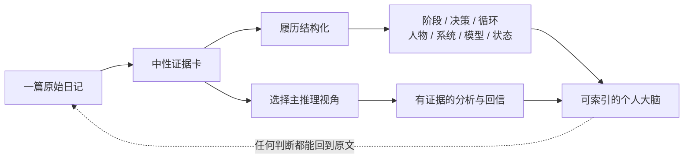

# LifeWiki Forge

> 让过去不再沉睡在一篇篇日记里。
>
> LifeWiki Forge 把个人过往履历结构化成一个可索引的大脑，再用来自不同领域、拥有不同性格与方法论的成功者视角重新理解你的经历，并写一封真正读过你来路的回信。

写日记解决了“把今天留下来”，却没有自动解决“怎样重新理解过去”。当几年、十几年累积成几百篇日记，重要的人、决定、转折和反复出现的模式仍然散落在日期里。你记得自己经历过，却很难在需要时找到它们，更难看见它们怎样共同塑造了今天的你。

LifeWiki Forge 做的事情，是把这些按日期排列的私人记录重新组织成一颗会生长的个人大脑：人生阶段、关键事件与决策、反复循环、人物关系、生活过的城市、职业与家庭系统、思维模型、状态趋势和那些值得保留的原句。你可以从任何判断回到原始日记，也可以从今天的问题反向索引整个过去。

它不是新的日记 App，也不只是“让 AI 总结一下”。它是一套面向 AI 编码智能体（Codex 等）的个人日记知识库构建框架：原始日记是不可随意改写的证据层，Wiki 是持续演化的理解层，而每一次分析和回信都必须尊重两者的边界。

## 它最终给你什么

### 1. 一颗可以索引过去的个人大脑

一篇日记只告诉你某一天发生了什么。结构化后的 Wiki 可以回答跨越很多年的问题：

- 我的人生经历过哪些真正的阶段？每个阶段怎样开始，又怎样结束？
- 哪些决定改变了后来的道路？当时还有什么选项？
- 我为什么总在相似的处境里焦虑、退让、过度用力或重新开始？
- 某个人在我的生命里承担过什么关系功能？这种关系怎样变化？
- 我的职业、家庭、身体、注意力和资产系统正在怎样运行？
- 哪些看似偶然的日记，其实共同验证了同一个个人思维模型？

过去不再是一串只能按日期翻阅的文件，而成为一张可以导航、查询、追溯和继续更新的生命地图。

### 2. 让不同领域、不同性格的成功者重新阅读你的经历

同一篇日记，可以因为观察者不同而显露出完全不同的问题。项目内置 8 个可动态发现的人物推理视角；下面重点展示其中四个差异鲜明的例子：

| 视角 | 首先会注意什么 | 更适合看见什么 |
|---|---|---|
| 查理·芒格 | 激励、机制、机会成本与少犯大错 | 你是否被错误反馈驱动，怎样避免不可逆损失 |
| 理查德·费曼 | 事实、未知、可验证问题与不自欺 | 哪个判断只是想当然，什么试验能增加真实信息 |
| 雅尼 | 情感、关系、普通生活与不强迫的创造 | 哪些感受值得被完整听见，而不必立刻变成行动 |
| 埃隆·马斯克 | 底层约束、关键瓶颈与验证速度 | 哪个惯例遮住了真正问题，下一验证台阶是什么 |

完整视角库还包括爱因斯坦、富兰克林、乔布斯和巴菲特，全部位于 [`reasoning-lenses/references/figures/`](skills/common/reasoning-lenses/references/figures/)，也可以继续增加新人物。

这些视角不是名人语气包，也不是让 AI 扮演某个人。系统先建立一张不带观点的中性证据卡，再选择真正能改变关注点和推理路径的主视角。日期、原句、人物和事件顺序不会因为换了视角而改变；改变的是你终于能从另一个有力量的位置重新看见自己的经历。

### 3. 一封读过你来路、也能触动你的回信

普通 AI 回信只看眼前这段文字，很容易变成安慰、建议和正确的废话。LifeWiki Forge 的近况回信会读取最新日记，再从个人 Wiki 中找出少量真正相关的旧经历：你曾经怎样做过选择、在哪些地方反复受困、什么东西对你一直重要。

它不会把每篇日记都变成行动清单，也不会急着给你下结论。一封信只围绕一个有证据的新理解展开。目标不是写得长，而是总有一句话能让你停一下，因为它既来自今天，也记得你一路怎样走到这里。

示例回信里有这样一句：

> 你得到的不是答案，而是重新拥有了做决定的位置。

这句话不是凭空生成的。它来自两篇相隔数周的日记：第一次想在最疲惫时辞职，第二次通过一个小试验重新获得信息和选择。你可以同时打开[原始日记](原始知识库/日记/2026-01-12%20忙碌不是方向.md)、[事件复盘](wiki/03%20关键事件与决策/是否离开远岚工作室.md)和[完整回信](wiki/12%20近况对话/给仍在犹豫的你.md)，看到这句话怎样从证据中生长出来。

### 4. 越写越了解你，而不是每次从零开始

每加入一篇日记，系统都会检查它是否改变了人生阶段、事件决策、循环、人物关系、现实系统、思维模型、状态或金句。旧页面会获得新证据，新的联系会被建立，过去的判断也可以被修正。

所以它不是一次性的“日记总结项目”，而是一颗随着你的生活持续生长、也允许推翻旧理解的第二大脑。

## 一篇日记怎样变成可索引的大脑



仓库放入了两篇完全虚构的连续日记和它们构建出的最小 Wiki。你可以沿着下面这条链路观察，一段“工作很忙、想辞职”的记录如何逐渐变成可复盘的个人知识：

```text
2026-01-12：忙碌、疲惫、想立刻辞职
        ↓
识别：焦虑 → 过度承诺 → 失去方向的循环
        ↓
2026-02-03：完成两周小试验，获得新的岗位信息
        ↓
沉淀：人生阶段、职业决策、职业系统、状态趋势、可逆决策模型
        ↓
回信：你没有立刻得到答案，但重新拥有了做决定的位置
```

从 [`wiki/index.md`](wiki/index.md) 可以浏览完整结果。

## 为什么这些理解值得信任

### 原始日记和综合判断严格分层

- `原始知识库/` 是证据层：正文默认不改写。
- `wiki/` 是综合层：允许持续修订，但重要判断必须链接回来源。
- 推断必须标明“推断”或“待查”，不会悄悄变成你的历史事实。

### 一次摄取会检查完整的人生影响

新增日记时，系统不会只更新最显眼的页面。`impact-matrix.md` 会逐项检查个人主线、人生阶段、循环、思维模型、现实系统、事件、人物、地点、状态、来源索引、导航、金句和近况回信，并明确记录 `update`、`link-only`、`no-op` 或 `defer`。

### 你的知识库不会被擅自改写

查询、解释、审查默认只读。只有当你明确说“更新”“摄取”“重建”或“修复”时，智能体才有权写入。发现一个好点子，不等于自动篡改 Wiki。

### 构建逻辑可以阅读、修改和验证

构建逻辑不是藏在一条超长提示词里，而是拆成职责单一的 Skill：查询、编排、人生复盘、人物、现实系统、状态、回信、规则调整和质量门。根目录 `AGENTS.md` 是唯一入口，`skills/` 是唯一规则源。

### Obsidian 原生，纯 Markdown，可离线

没有数据库锁定，没有专有格式。WikiLink、YAML frontmatter 和目录本身就是数据结构。Obsidian 是推荐阅读界面，但不是运行必需品。

## 目录结构

```text
lifewiki-forge/
├── AGENTS.md                  # 唯一入口：授权边界与 Skill 路由
├── 原始知识库/                # 证据层；附 2 篇虚构示例日记
│   └── 日记/
├── wiki/                     # 综合层；附一套最小可浏览样例
│   ├── 00 总入口/
│   ├── 01 个人主线/
│   ├── 02 人生阶段/
│   ├── 03 关键事件与决策/
│   ├── 04 反复循环/
│   ├── 05 人物关系图谱/
│   ├── 06 现实系统/
│   ├── 07 人物与城市/
│   ├── 08 来源索引/
│   ├── 09 思维模型/
│   ├── 11 状态追踪/
│   ├── 12 近况对话/
│   ├── 13 金句集锦/
│   └── 99 维护规则/
├── skills/                   # 模型可执行的构建、查询和质量规则
├── tools/                    # 标签、链接、隐私与 Skill 结构验证
└── docs/                     # 架构、定制与隐私指南
```

## 快速开始

### 1. 准备环境

- Python 3.10 或更高版本；只使用标准库。
- 支持读取 `AGENTS.md` 与本地 Skill 的 AI 编码智能体。项目最初为 Codex 设计，也可适配其他智能体。
- 可选：Obsidian，用于图谱浏览和日常阅读。

### 2. 克隆并验证

```bash
git clone <your-repository-url> lifewiki-forge
cd lifewiki-forge
python3 tools/check.py
```

成功时会看到标签检查、WikiLink 检查、Skill 体系检查和隐私检查全部通过。

### 3. 先浏览样例

从 [`wiki/index.md`](wiki/index.md) 开始，随后打开 [`原始知识库/日记/2026-01-12%20忙碌不是方向.md`](原始知识库/日记/2026-01-12%20忙碌不是方向.md)，对照它在 Wiki 中形成的阶段、循环和系统页面。

### 4. 换成你自己的内容

1. 删除 `原始知识库/日记/` 中的虚构示例。
2. 把自己的 Markdown 日记放进该目录；也可以新增读书笔记、历史材料或对话目录。
3. 保留目录结构，按需要修改 `skills/` 中的分类与模板。
4. 对智能体说：

```text
请摄取“原始知识库/日记/2026-xx-xx xxx.md”，更新 Wiki，
逐项填写影响矩阵，完成后运行质量门。
```

宽泛更新也可以直接说：

```text
跑一下 Wiki，处理原始知识库里新增加的材料。
```

查询默认不会写入：

```text
基于现有 Wiki，总结我在职业选择上反复出现的模式；必要时回到原始日记核对，只读回答。
```

让不同视角分析一篇日记：

```text
先建立不带观点的中性证据卡，再分别用芒格、费曼、雅尼和马斯克的
推理视角分析这篇日记。说明每个视角看见了什么、忽略了什么，
不要模仿人物口吻，也不要把推断写成事实。
```

写一封真正记得你过去的回信：

```text
读完最新日记，再从现有 Wiki 中寻找少量真正相关的旧经历。
选择最适合的一个主视角，像一个了解我来路的朋友那样写封回信：
围绕一个有证据的新理解，不说教，不强行给行动清单。
```

## 一次构建实际会做什么

以示例日记为例：

1. 根 `AGENTS.md` 判断这是获授权的摄取请求。
2. `wiki-build` 读取原始日记，填写完整影响矩阵。
3. 不同领域 Skill 只更新自己负责的页面。
4. 需要解释或回信时，先建立中性证据卡，再选择真正合适的主推理视角。
5. 回信读取最新日记和少量相关旧线索，只围绕一个新理解展开。
6. 所有新增判断链接回原始日记；无证据部分省略或标为推断。
7. 更新来源索引、公共导航和构建日志。
8. 连续运行两次标签更新，第二次必须 `updated=0`。
9. 验证 WikiLink、Skill 路由与潜在隐私信息。

详细设计见 [`docs/architecture.md`](docs/architecture.md)，个性化步骤见 [`docs/customization.md`](docs/customization.md)。

## 常用命令

```bash
# 一键质量检查
python3 tools/check.py

# 更新 Obsidian 管理标签；写入后需要连续运行两次
python3 tools/update_obsidian_tags.py

# 检查 WikiLink
python3 tools/validate_wiki_links.py

# 检查 Skill 路由与引用
python3 tools/validate_skill_system.py

# 检查常见秘密、联系方式和本机绝对路径
python3 tools/privacy_scan.py
```

## 设计边界

- 这不是心理诊断工具，综合页中的解释不能冒充医学事实。
- 推理视角不是人物模拟器，不模仿口头禅，也不把公开人物原则当成你的证据。
- 自动化验证能发现结构问题，不能替代对重要人生判断的人工复核。
- 不建议把真实私人仓库直接公开。公开前请阅读 [`docs/privacy.md`](docs/privacy.md) 并运行隐私扫描。

## 路线图

- [ ] 提供更多来源适配示例（读书笔记、聊天记录、语音转写）。
- [ ] 增加可选的静态站点导出。
- [ ] 增加跨平台的增量变更检测。
- [ ] 增加匿名化示例生成器与更强的隐私规则配置。

## 参与贡献

欢迎提交新的领域 Skill、验证器、文档改进和匿名化样例。请先阅读 [`CONTRIBUTING.md`](CONTRIBUTING.md)。涉及真实个人材料时，贡献者有责任完成授权与脱敏。

## License

本项目采用 [MIT License](LICENSE)。示例日记和示例 Wiki 均为虚构内容，仅用于演示信息架构。

---

**English summary:** LifeWiki Forge turns years of scattered journals into an indexed, traceable personal brain. It structures life stages, decisions, recurring patterns, relationships, systems, and personal models; then uses distinct reasoning lenses to analyze new entries and write reflective letters grounded in both the latest journal and the history behind it.
