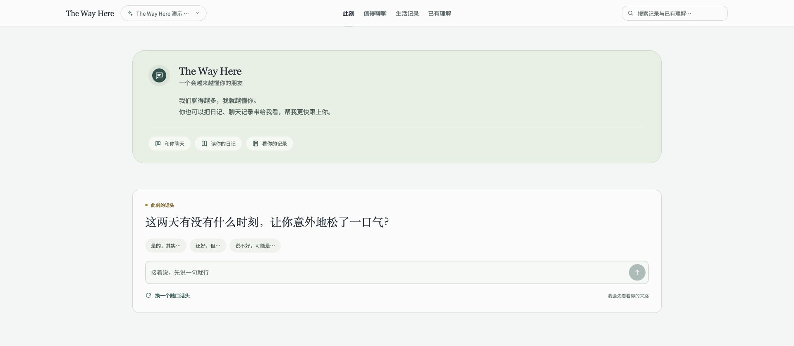
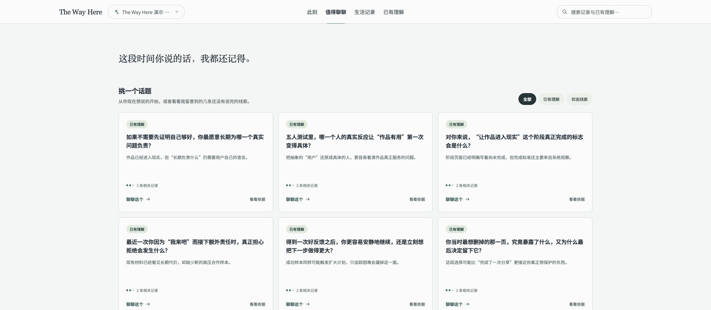
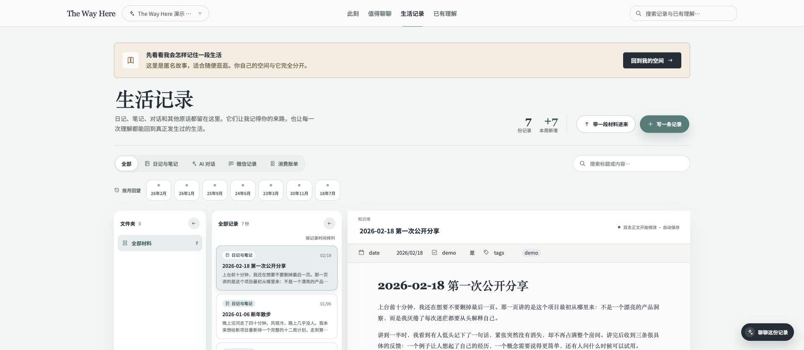

# The Way Here

> 有什么，都可以聊聊。

## 项目定位

The Way Here 想成为一个会记得你的来路、越聊越懂你的长期朋友。

生活常常散落在不同地方：日记、和重要之人的对话、与 AI 的长谈、一张照片，或者某个当时没有意识到会如此重要的句子。普通聊天很容易在窗口关闭后失去前因后果，笔记又常常只是被保存，很少在真正需要时回来陪你理解眼前的事。

The Way Here 会把这些原话和经历好好留下来，也记住它们之间的联系。你可以从此刻的一句话开始，也可以先带进一段生活记录。一路聊下来的理解都能回到原始材料，任何时候你都可以说：“不是这样的。”

它不是替你下结论的心理分析，也不是聊完即忘的通用 AI。它更像一位长期认识你的朋友：记得来路，尊重未知，陪你把生活慢慢理清。



### 从此刻想说的事开始

你不需要先整理好自己，也不需要面对一个空白输入框。首页会先问一个此刻可以回答的具体问题；“值得聊聊”则把生活里仍未说完的线索放在一起，让你挑一个真正想继续的话题。

每个问题都带着已有理解，也保留仍然未知的部分。你可以直接聊，也可以先回到相关记录，看看它为什么会在此刻被提起。



### 原话留下，理解才有来处

日记、笔记、AI 对话、微信记录和消费账单，都可以作为生活记录留在本地。原始内容始终可以完整阅读，不会在整理后只剩几个标签或一句摘要。

这些记录不是一次性的输入。后来形成的判断、人生阶段、关系和回信，都能沿着链接回到当时真正写下的句子，等待你核对、补充和纠正。



### 理解会生长，也会被修正

“已有理解”把关于你自己的判断、人生轨迹，以及身边人与关系的记录放在同一个空间。新的经历可能补充证据，也可能让旧判断失效；这里留下的是当前理解，不是关于你的最终结论。

无论正停在哪一页，都可以从右下角继续聊。对话会带着当前页面和个人空间的上下文，但是否要把新理解长期留下，会继续区分证据、推断与未知。


## 你的经历，默认只留在你的电脑里

人生材料足够珍贵，也足够私密。The Way Here 采用本地优先的方式运行：你的日记、对话与构建出的 Wiki 默认都保存在本机，服务也只监听 `127.0.0.1`。公开仓库中只有匿名演示库，不包含真实的私人内容。

项目把三部分彼此隔离：

- `studio/` 提供本地 Web 产品、API 服务、索引和 Agent 对话。
- `knowledge-engine/` 提供可复用的知识构建 Skills、路由和确定性质量工具。
- `vault/` 只保存原始材料与构建后的 Wiki；公开仓库仅包含匿名 `demo`。

目前它被设计为属于一个人的桌面端本地工具，不包含账号体系、多用户权限或公网部署能力。如果要放到远程环境，请先补充认证、TLS、CSRF 防护和更严格的运行沙箱。

## 快速启动

仓库已经准备好一套匿名 `demo`。你不需要先交出自己的日记，就可以看看 The Way Here 会怎样记住一段生活、提出值得聊聊的问题，并让理解慢慢长出来。

环境要求：

- macOS 或 Linux
- Python 3
- Node.js 22.19+ 与 pnpm 11.19.0；一键启动脚本会在需要时为项目准备本地版本
- 使用 AI 对话时，需要可用的 Codex CLI，或在配置中提供 Pi 模型服务

克隆或下载仓库后，在项目根目录运行：

```bash
./start.sh
```

脚本会自动检查环境、安装依赖并构建前后端。启动完成后，打开 <http://127.0.0.1:4321>；按 `Ctrl+C` 可以同时停止所有服务。

指定端口：

```bash
./start.sh --port 8080
```

当你准备开始自己的空间时，可以直接从演示页提示或左上角入口创建。它会成为一套独立的本地知识库，不会复制或混入演示数据。

也可以在 `the-way-here.config.yaml` 中登记已有知识库目录：

```yaml
knowledgeBases:
  personal:
    name: "My private Wiki"
    paths:
      wiki: "vault/personal/wiki"
      sources: "vault/personal/sources"
```

`vault/personal/` 已被 Git 忽略。请不要把真实日记、人物资料、聊天记录、任务快照、Agent 会话、本机路径或密钥提交到公开仓库。

需要临时指定空间时，可以运行：

```bash
./start.sh --knowledge-base personal
```

也可以打开另一套完整工作区：

```bash
./start.sh --vault /absolute/path/to/your-workspace --knowledge-base personal
```

该工作区需要包含自己的 `the-way-here.config.yaml`，并且配置中的路径必须位于工作区边界内。

## 开发与验证

如果你想参与开发，可以从 `studio/` 启动前后端开发环境：

```bash
cd studio
pnpm install
pnpm dev -- --vault .. --knowledge-base demo
```

提交改动前运行：

```bash
pnpm typecheck
pnpm test
pnpm build
```

修改 Wiki、Skills 或维护工具时，还应在项目根目录运行对应质量门：

```bash
THE_WAY_HERE_KNOWLEDGE_BASE=demo python3 knowledge-engine/tools/update_obsidian_tags.py
THE_WAY_HERE_KNOWLEDGE_BASE=demo python3 knowledge-engine/tools/update_obsidian_tags.py
THE_WAY_HERE_KNOWLEDGE_BASE=demo python3 knowledge-engine/tools/validate_wiki_links.py
THE_WAY_HERE_KNOWLEDGE_BASE=demo python3 knowledge-engine/tools/validate_skill_system.py
```

第二次标签更新应报告 `updated=0`，链接检查应报告 `missing=0 ambiguous=0`。

## 目录结构

```text
the-way-here/
├── the-way-here.config.yaml     # 知识库注册与运行时配置
├── start.sh                     # 一键启动入口
├── knowledge-engine/            # 共享 Skills、路由与质量工具
├── studio/                      # Web 产品、API 服务与 Agent 编排
├── vault/
│   └── demo/                    # 可公开的匿名来源与 Wiki 示例
└── docs/images/                 # README 使用的匿名产品截图
```

项目采用 [MIT License](LICENSE)。
