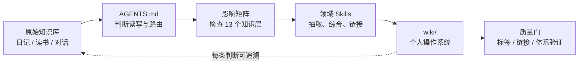

# LifeWiki Forge

> 把日记、读书笔记与生活记录，编译成一个有来源、会演化、可复盘的个人 Wiki。

LifeWiki Forge 是一套面向 AI 编码智能体（Codex 等）的个人知识库构建框架。它把你的原始笔记保留为不可随意改写的“证据层”，再由一组可审查的 Skill 将材料持续整理成“综合层”：人生阶段、关键决策、反复循环、人物关系、现实系统、思维模型、状态趋势与近况回信。

它不是一个新的笔记 App，也不是把所有文档塞进向量数据库后临时问答。它更像一套个人 Wiki 的编译器：每次新增材料，都经过路由、影响分析、领域构建与质量检查，最终得到可以长期维护、互相链接、能够回到原文核对的知识结构。

## 30 秒看懂



仓库已经放入两篇完全虚构的示例日记，以及它们编译出的最小 Wiki。你可以沿着链接直接观察：一段“工作很忙、想离开”的原始记录，怎样进入人生阶段、事件决策、反复循环、职业系统、状态追踪和思维模型，而不是只生成一份泛泛总结。

## 为什么值得用

### 1. 原始材料和综合判断严格分层

- `原始知识库/` 是证据层：正文默认不改写。
- `wiki/` 是综合层：允许持续修订，但重要判断必须链接回来源。
- 推断必须标明“推断”或“待查”，不会悄悄变成你的历史事实。

### 2. 一次摄取，不漏掉生活的其他侧面

新增日记时，系统不会只更新最显眼的页面。`impact-matrix.md` 会逐项检查个人主线、人生阶段、循环、思维模型、现实系统、事件、人物、地点、状态、来源索引、导航、金句和近况回信，并明确记录 `update`、`link-only`、`no-op` 或 `defer`。

### 3. 权限边界清晰

查询、解释、审查默认只读。只有当你明确说“更新”“摄取”“重建”或“修复”时，智能体才有权写入。发现一个好点子，不等于自动篡改 Wiki。

### 4. Skill 是可读、可改、可验证的

构建逻辑不是藏在一条超长提示词里，而是拆成职责单一的 Skill：查询、编排、人生复盘、人物、现实系统、状态、回信、规则调整和质量门。根目录 `AGENTS.md` 是唯一入口，`skills/` 是唯一规则源。

### 5. 不只记录“发生了什么”

这套结构特别关注那些普通知识库很难沉淀的内容：

- 我为什么在相似处境里反复做出同一种反应？
- 某次决定当时有哪些选项、代价与事后判断？
- 一个人在我生命里承担的“关系功能”如何变化？
- 职业、身体、注意力、家庭等现实系统正在变好还是变坏？
- 哪条个人规则真的经受过现实验证？

### 6. 可选的推理视角，但不让“名人观点”污染事实

共享推理视角可以帮助智能体从不同角度解释同一份证据；事实卡、日期、原句和实体信息始终保持中性。视角只负责解释，不负责制造证据，也不能越过领域 Skill 的归档边界。

### 7. Obsidian 原生，纯 Markdown，可离线

没有数据库锁定，没有专有格式。WikiLink、YAML frontmatter 和目录本身就是数据结构。Obsidian 是推荐阅读界面，但不是运行必需品。

## 目录结构

```text
lifewiki-forge/
├── AGENTS.md                  # 唯一入口：授权边界与 Skill 路由
├── 原始知识库/                # 证据层；附 2 篇虚构示例日记
│   └── 日记/
├── wiki/                     # 综合层；附一套最小可浏览样例
│   ├── 00 总入口/
│   ├── 01 个人主线/
│   ├── 02 人生阶段/
│   ├── 03 关键事件与决策/
│   ├── 04 反复循环/
│   ├── 05 人物关系图谱/
│   ├── 06 现实系统/
│   ├── 07 人物与城市/
│   ├── 08 来源索引/
│   ├── 09 思维模型/
│   ├── 11 状态追踪/
│   ├── 12 近况对话/
│   ├── 13 金句集锦/
│   └── 99 维护规则/
├── skills/                   # 模型可执行的构建、查询和质量规则
├── tools/                    # 标签、链接、隐私与 Skill 结构验证
└── docs/                     # 架构、定制与隐私指南
```

## 快速开始

### 1. 准备环境

- Python 3.10 或更高版本；只使用标准库。
- 支持读取 `AGENTS.md` 与本地 Skill 的 AI 编码智能体。项目最初为 Codex 设计，也可适配其他智能体。
- 可选：Obsidian，用于图谱浏览和日常阅读。

### 2. 克隆并验证

```bash
git clone <your-repository-url> lifewiki-forge
cd lifewiki-forge
python3 tools/check.py
```

成功时会看到标签检查、WikiLink 检查、Skill 体系检查和隐私检查全部通过。

### 3. 先浏览样例

从 [`wiki/index.md`](wiki/index.md) 开始，随后打开 [`原始知识库/日记/2026-01-12%20忙碌不是方向.md`](原始知识库/日记/2026-01-12%20忙碌不是方向.md)，对照它在 Wiki 中形成的阶段、循环和系统页面。

### 4. 换成你自己的内容

1. 删除 `原始知识库/日记/` 中的虚构示例。
2. 把自己的 Markdown 日记放进该目录；也可以新增读书笔记、历史材料或对话目录。
3. 保留目录结构，按需要修改 `skills/` 中的分类与模板。
4. 对智能体说：

```text
请摄取“原始知识库/日记/2026-xx-xx xxx.md”，更新 Wiki，
逐项填写影响矩阵，完成后运行质量门。
```

宽泛更新也可以直接说：

```text
跑一下 Wiki，处理原始知识库里新增加的材料。
```

查询默认不会写入：

```text
基于现有 Wiki，总结我在职业选择上反复出现的模式；必要时回到原始日记核对，只读回答。
```

## 一次构建实际会做什么

以示例日记为例：

1. 根 `AGENTS.md` 判断这是获授权的摄取请求。
2. `wiki-build` 读取原始日记，填写完整影响矩阵。
3. 不同领域 Skill 只更新自己负责的页面。
4. 所有新增判断链接回原始日记；无证据部分省略或标为推断。
5. 更新来源索引、公共导航和构建日志。
6. 连续运行两次标签更新，第二次必须 `updated=0`。
7. 验证 WikiLink、Skill 路由与潜在隐私信息。

详细设计见 [`docs/architecture.md`](docs/architecture.md)，个性化步骤见 [`docs/customization.md`](docs/customization.md)。

## 常用命令

```bash
# 一键质量检查
python3 tools/check.py

# 更新 Obsidian 管理标签；写入后需要连续运行两次
python3 tools/update_obsidian_tags.py

# 检查 WikiLink
python3 tools/validate_wiki_links.py

# 检查 Skill 路由与引用
python3 tools/validate_skill_system.py

# 检查常见秘密、联系方式和本机绝对路径
python3 tools/privacy_scan.py
```

## 设计边界

- 这不是心理诊断工具，综合页中的解释不能冒充医学事实。
- 推理视角不是人物模拟器，不模仿口头禅，也不把公开人物原则当成你的证据。
- 自动化验证能发现结构问题，不能替代对重要人生判断的人工复核。
- 不建议把真实私人仓库直接公开。公开前请阅读 [`docs/privacy.md`](docs/privacy.md) 并运行隐私扫描。

## 路线图

- [ ] 提供更多来源适配示例（读书笔记、聊天记录、语音转写）。
- [ ] 增加可选的静态站点导出。
- [ ] 增加跨平台的增量变更检测。
- [ ] 增加匿名化示例生成器与更强的隐私规则配置。

## 参与贡献

欢迎提交新的领域 Skill、验证器、文档改进和匿名化样例。请先阅读 [`CONTRIBUTING.md`](CONTRIBUTING.md)。涉及真实个人材料时，贡献者有责任完成授权与脱敏。

## License

本项目采用 [MIT License](LICENSE)。示例日记和示例 Wiki 均为虚构内容，仅用于演示信息架构。

---

**English summary:** LifeWiki Forge is an evidence-first, agent-maintained personal wiki framework. It keeps raw notes immutable, compiles them into a traceable Markdown/Obsidian knowledge layer through modular Skills, and validates links, routing, tags, and privacy before changes are considered complete.
